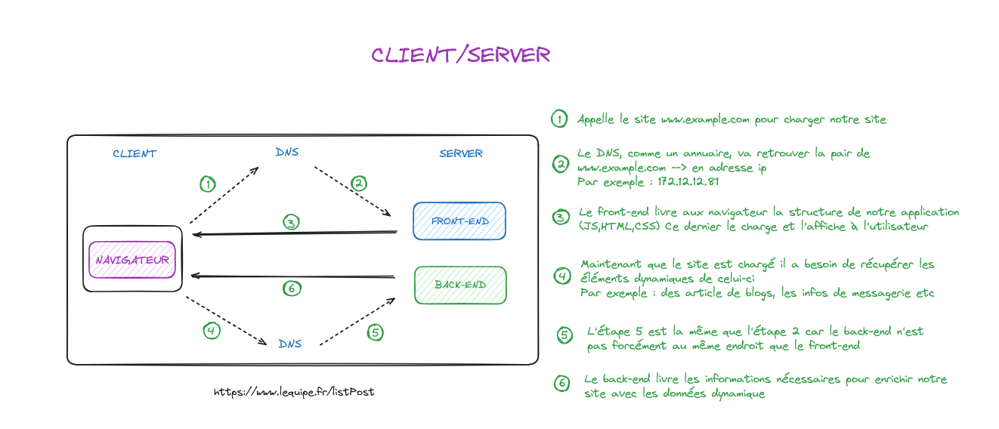
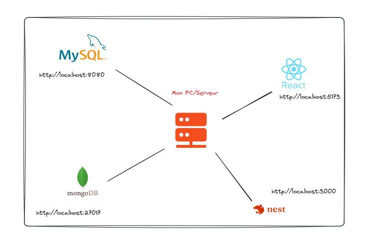

# 1️⃣ Environnement Général

Il faut bien comprendre que Front et le Back sont stockées sur un serveur.

* Dans notre cas le Front est une application, le Back est une autre application. \n(Nous avons 2 applications différentes)\n
* Le client c'est notre navigateur qui interprète le code provenant du Front.\n
* Les fichiers de l'application Front-end sont stockés sur un serveur, mais ils sont téléchargés et exécutés dans le navigateur de l'utilisateur\n
* Le DNS (Domaine Name System) permet d'associer un nom de domaine à une adresse IP

\n Pour le développement des applications, le PC fera office de serveur. Ainsi les applications seront autonome avec une adresse ip commençant par <http://localhost> et pour les différencier elles auront un port spécifique

Exemple

* Le projet React front               → <http://localhost:5173>
* Le projet Nest pour le back → <http://localhost:3000>

\n**Le client sera le navigateur comme dit plus haut**