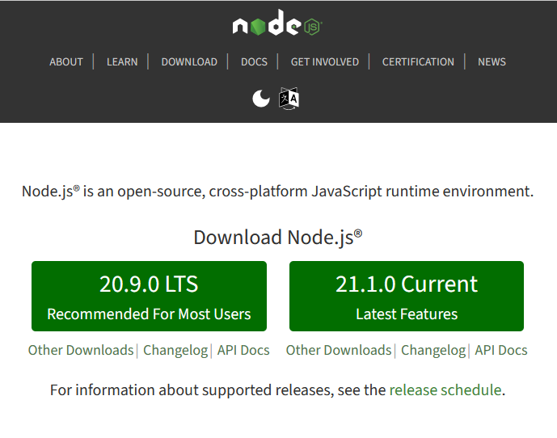
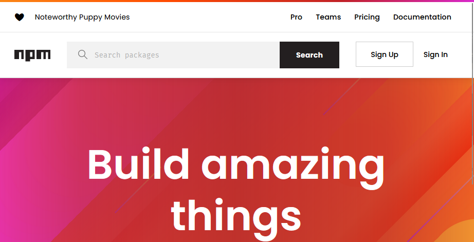
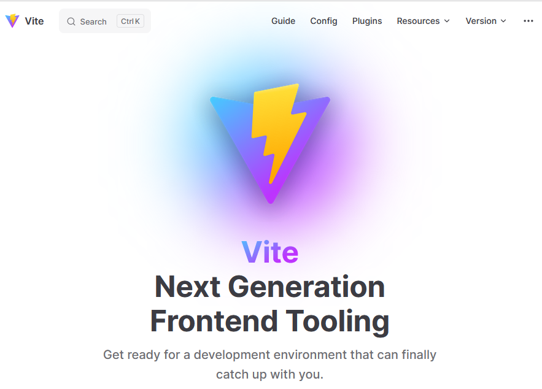

# 2️⃣ Environnement Javascript

## **Qu'est-ce que Node.js ?**

##  

Node.js est une plateforme d'exécution JavaScript construite sur le moteur JavaScript V8 de Chrome. Contrairement à JavaScript dans le navigateur, qui est principalement utilisé pour les interactions côté client, Node.js nous permet d'exécuter JavaScript côté serveur.\*

## **Qu'est-ce que npm ?**

 

\nnpm est à la fois un gestionnaire de paquets et une commande **fournie avec Node.js.** Il permet aux développeurs d'installer et de gérer des bibliothèques et des outils, qui sont souvent nécessaires dans les projets modernes de développement web. \n

## **Qu'est-ce que vite JS ?** 

Vite est un outil de construction (ou build tool) pour le développement front-end. Vite offre une nouvelle approche pour gérer et construire des applications JavaScript modernes, en particulier par rapport aux outils plus traditionnels comme Webpack.

Voici quelques points clés concernant Vite :

1. **Démarrage Rapide** : Grâce à l'utilisation du navigateur natif ES modules, Vite fournit un démarrage de serveur de développement extrêmement rapide.
2. **Hot Module Replacement (HMR)** : Vite dispose d'un remplacement de module à chaud très performant qui applique instantanément les modifications à votre code sans recharger la page entière.
3. **Optimisation pour la production** : Vite utilise Rollup pour le regroupement (ou bundling) des ressources pour la production, profitant de la haute performance de Rollup pour l'optimisation des modules ES.
4. **Plugins** : Vite prend en charge les plugins, ce qui vous permet d'étendre ses fonctionnalités et d'ajouter une prise en charge pour d'autres frameworks ou bibliothèques, ou d'autres transformations personnalisées.
5. **Transformation à la demande** : Au lieu de transformer tout le code source en une seule fois lors du démarrage, Vite transforme uniquement le code à la demande. Cela signifie qu'il ne travaille que sur les fichiers actuellement en cours d'utilisation, ce qui améliore la performance lors du développement.
6. **Prise en charge native des CSS, des images et d'autres ressources** : Vite peut gérer d'autres types de fichiers en plus du JavaScript, comme les fichiers CSS ou les images, en les transformant et en les optimisant pour la production.