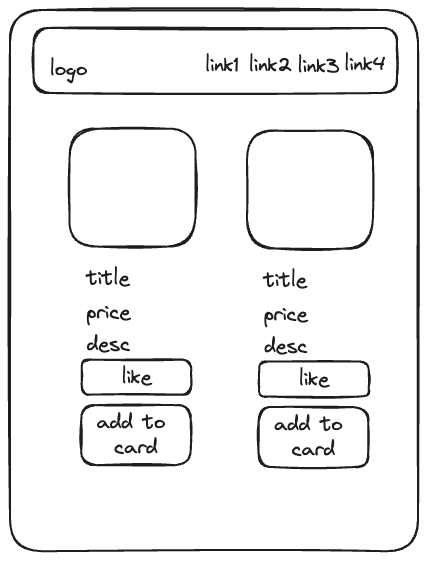

# Pratique

## Création d'une boutique en 'ligne'


 

### Coder une page de boutique en ligne avec les composants suivants: 

* App 
* NavigationBar 
* ProductDetail 

**Faire le schéma dans excalidraw.**

Sur la base des données suivants : https://fakestoreapi.com/products, copiez/collez les données dans un fichier et affichez tous les produits produits stockés le tableau d'objects (produit) avec typage typescript.


Chaque produit affichera les données suivantes : 

* image
* titre
* prix
* description
* bouton 'like'
* bouton 'ajouter au panier'

On oublie pas typescript ;)


\
### Sur la base du JSON ci-dessous, créez dynamiquement le menu de la bar de navigation.


```typescript
const links = [
    {
        name: 'Home',
        path: '/home'
    },
    {
        name: 'Movies',
        path: '/movies'
    },
    {
        name: 'Message',
        path: '/message'
    },
    {
        name: 'Contact',
        path: '/contact'
    }
]
```


<https://daisyui.com/>

<https://tailwindcss.com/docs/installation/using-vite>