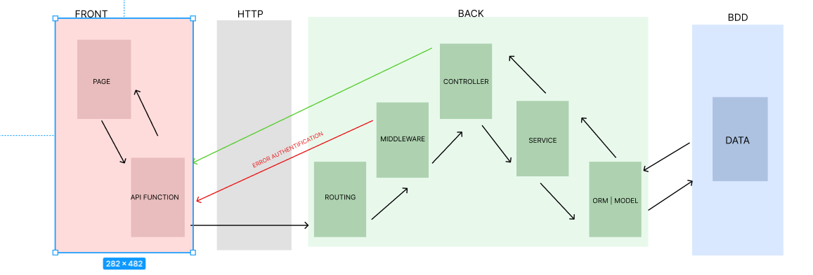

# 2️⃣ Utilisation Axios

Axios est un client HTTP *[basé sur les promesses](https://fr.javascript.info/promise-basics)* compatible avec node.js et les navigateurs. \nIl est *[isomorphique](https://www.lullabot.com/articles/what-is-an-isomorphic-application)* (c'est à dire qu'il peut opérer dans le navigateur et dans node.js avec le même code). \nCôté serveur, il utilise le module natif http de node.js, et côté client (navigateur) il utilise les XMLHttpRequests.\n\nEn JavaScript, une "promesse" (Promise) est un objet qui représente une valeur qui peut ne pas être disponible immédiatement, mais le sera peut-être à l'avenir. Les promesses sont utilisées pour gérer des opérations asynchrones, telles que des requêtes réseau, des lectures de fichiers, etc. Une promesse peut se trouver dans un de ces trois états :

* **En attente** (*pending*) : L'opération n'est pas encore terminée.
* **Résolue** (*fulfilled*) : L'opération s'est terminée avec succès et la promesse a une valeur.
* **Rejetée** (*rejected*) : L'opération a échoué et la promesse a une raison d'échec.

Le mot-clé **async** est utilisé pour déclarer une fonction comme asynchrone. Cela signifie que la fonction peut exécuter des opérations asynchrones et retournera une promesse. L'avantage des fonctions async est qu'elles permettent d'utiliser le mot-clé await à l'intérieur, simplifiant ainsi la syntaxe pour manipuler des promesses.

Le mot-clé **await** est utilisé pour attendre la résolution d'une promesse à l'intérieur d'une fonction async. Quand await est utilisé, il fait en sorte que la fonction asynchrone attende que la promesse soit résolue ou rejetée avant de continuer son exécution. Cela rend le code asynchrone plus lisible et plus simple à écrire, car il ressemble davantage à une séquence d'opérations synchrone.


 


## \n**I) Installation** 

\nPour l'utiliser il nous faut installer le package axios que l'on trouvera ici : \n<https://www.npmjs.com/package/axios>

## \nII) **Utilisation :** 

\nDans notre cas nous avons créé un dossier spécifique dans notre projet :  **services/api/todos** \nL'objectif est de centraliser nos fonctions puis de les utiliser dans les pages que l'on souhaite

```typescript
import axios from "axios";

export async function getTodos() {
    try {
        const { data } = await axios.get('https://jsonplaceholder.typicode.com/todos');
        return data;
    } catch (error) {
        console.log(error)
    }
}

export async function getTodoById(id:any) {
    try {
        const { data } = await axios.get(`https://jsonplaceholder.typicode.com/todos/${id}`)
        console.log(data);
        return data;
    } catch (error) {
        console.log(error)
    }
}
```


Ici nous souhaitons charger notre page, d'une liste de todos, au moment ou celle-ci est montée.\nAinsi nous traitons avec cette requête dans le useEffect.\n\nNéanmoins si nous souhaitons charger les données depuis un événement utilisateur nous pouvons utiliser getTodos dans une fonction spécifique. 

```typescript
import { useEffect, useState } from "react"
import { getTodoById, getTodos } from "../../services/api/todo";

export default function HomePage() {

    const [todos, setTodos] = useState<any>([])

    useEffect(() => {
        console.log("Je suis dans le useEffect");

        async function loadTodos() {
            const todos = await getTodos();
            setTodos(todos)
        }
        
        async function loadTodobyId(){
            const myTodo = await getTodoById(idMessage)
            console.log(myTodo)
        }

        loadTodos();
        loadTodobyId();
    }, [])
    
      async function submitMessage() {
        const todos = await getTodos();
        setTodos(todos)
    }

    return (
        <>
            <h1> Home Page</h1>

            <p> Ceci est la page d'accueil</p>
            
            <button onClick={submitMessage}> Charger les données </button>
        </>
    )
}
```


\